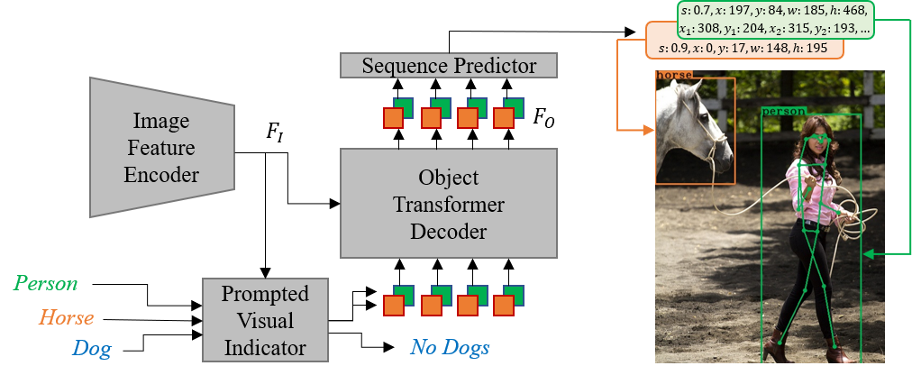

**Obj2Seq**: Formatting Objects as Sequences with Class Prompt for Visual Tasks
========

## Introduction
This repository is an official implementation of the **Obj2Seq**.
Obj2Seq takes objects as basic units, and regards most visual tasks as sequence generation problems of objects.
It first recognizes objects of given categories, and then generates a sequence to describe each of these objects. Obj2Seq is able to flexibly determine input categories and the definition of output sequences to satisfy customized requirements, and be easily extended to different visual tasks.





## Main Results


### Object Detection

|                        |  Epochs |  Params(M)  |  AP     |  Config/Model  |
|:----------------------:|:-------:|:-----------:|:-------:|:--------------:|
| DeformableDETR         |  50     |  40         |  44.5   |                |
| Obj2Seq                |  50     |  40         |  45.7   | [config](configs/detection_r50.yaml) |
| + iterative box refine |  50     |  42         |  46.7   | [config](configs/detection_r50_box_refine.yaml) |

### Human Pose Estimation

|            |  Epochs |  Params(M)  |  AP     |  Config/Model  |
|:----------:|:-------:|:-----------:|:-------:|:--------------:|
| Baseline   |  50     |  40         |  57.2   | [config](configs/keypoint_baseline_50e.yaml) |
| Obj2Seq    |  50     |  40         |  60.1   | [config](configs/keypoint_seqhead_50e.yaml)  |
| Obj2Seq    |  150    |  40         |  65.0   | [config](configs/keypoint_seqhead_150e.yaml) |

*Note:*
1. The results are based on ResNet-50 backbone.
2. Our model will also be released later.


## Usage

### Installation
First, clone the repository locally:
```
git clone https://github.com/CASIA-IVA-Lab/Obj2Seq.git
```
Then, install dependencies:
```
pip install -r requirements.txt
```
Install Multi-Scale Deformable Attention
```
cd models/ops
bash ./make.sh
```

### Data Preparation

Link path to coco2017 to data/coco
```
mkdir data
ln -s /path/to/coco data/coco
```
or modify data path in config files
```
coco_path: /path/to/coco
anno_train: /path/to/coco_train_json_file
anno_val: /path/to/coco_val_json_file
```

### Training
To train with slurm on multiple nodes:
```
bash scripts/run_slurm.sh NUM_NODES /path/to/config /path/to/output/dir [OTHER_ARGS]
```
For example, to train Obj2Seq on 2 nodes:
```
bash scripts/run_slurm.sh 2 configs/detection_r50.yaml checkpoints/detection_r50
```

We also provide scripts for pytorch distributed training:
```
bash run.sh /path/to/config /path/to/output/dir
```

Make sure to modify `DATA.batch_size` (number of images on each GPU) in config and `PARTITION` in `run_slurm.sh` first.

### Evaluation
To evaluate Obj2Seq on a single node with 8 GPUs:
```
bash run.sh /path/to/config /path/to/output/dir --eval [--resume /path/to/checkpoint.pth] 
```

## Citation

If you find this project useful for your research, please consider citing this paper.


## Acknowledgement
We thank all repositories we refer to for their contributions in the open source community.

| Code asset      | License    | Utility |
|:---------------:|:----------:|:-----------:|
| DETR            | Apache 2.0 | Foundation for our code |
| Deformable DETR | Apache 2.0 | Foundation for our code |
| Anchor DETR     | Apache 2.0 | Foundation for our code |
| ASL             | MIT        | Asymmetric loss for classification |
| Query2Label     | MIT        | Metric for classification |
| Detic           | Apache 2.0 | Generate CLIP-initialized vectors |
| CLIP            | MIT        | Generate CLIP-initialized vectors |
| Mask R-CNN      | MIT        | Dataset for keypoint annotations |
| Swin Transformer| MIT        | Config file |